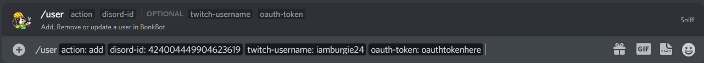
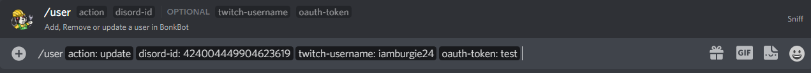
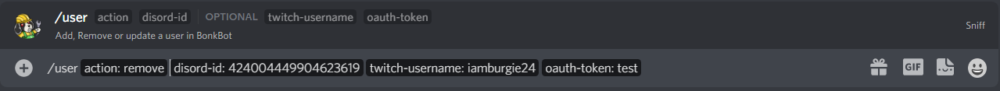

# User Setup

## Authentication

Authentication only works through Sniff's website: [Sniffbot.dev](https://sniffbot.dev/login/).

Login to Twitch and copy the token.

You will be given a channel by a bot admin to setup an account on the bot using the [/user](/moderationlogs/user-setup/user-command) command

## User Data Command

Usage: `/user <add/remove/update> <Discord-id> (token) (Twitch-username)`

This command gives you the option to add remove or update your user data in the bot. Running this command is **required** before your able to use the bot.

### Adding a User

Usage: `/user add <Discord-id> <token> <Twitch-username>`

When adding a user, you must include a Oauth token, this can be found under [Authentication](/moderationlogs/setup#authentication)

After running this command you have access to moderation logs through Sniff.

### Updating a User

Usage: `/user update <token>`

This command allows you to update your token.

## Removing a User

Usage: `/user remove <Discord-id>`

This command removes you from the bot. Once you run this command you will lose access to moderation logs until you re-add yourself.

:::note Note

This only works with Discord slash commands.

:::